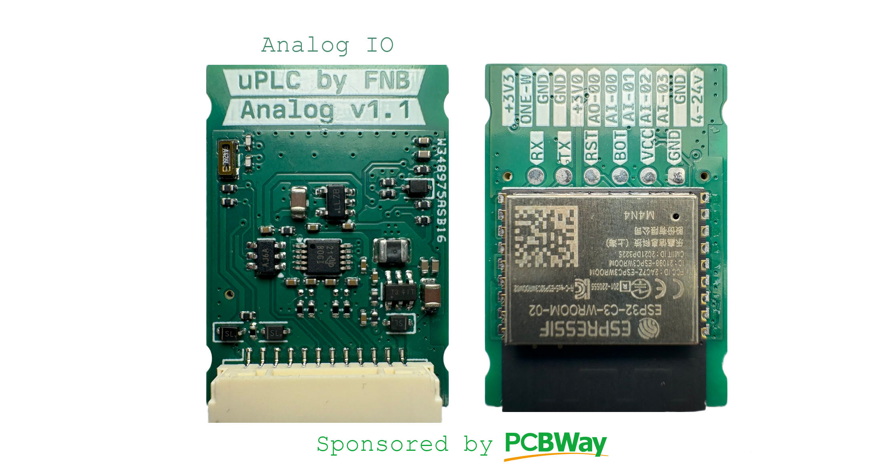
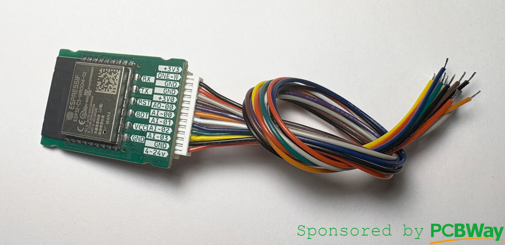
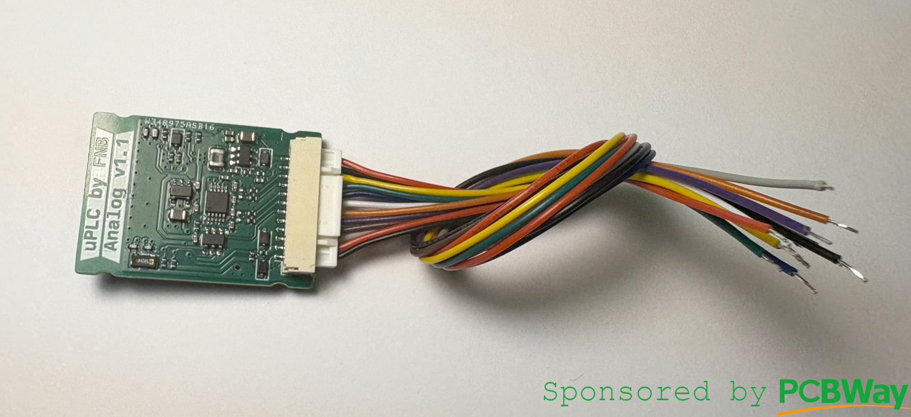
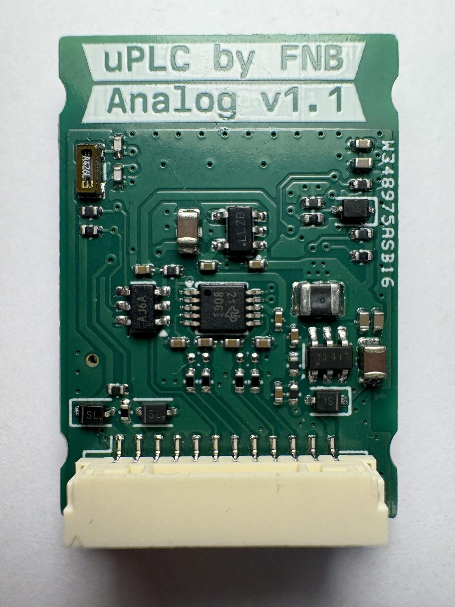
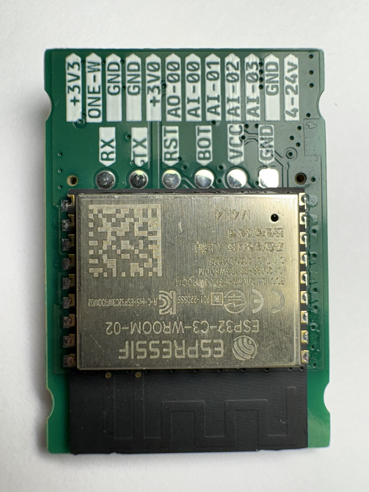

# μPLC - Analog
### Pcbway Sponsorship
Thanks so much to [PCBWay](https://www.pcbway.com/) who offered to assemble my first prototype batch of all three [uPLC modules](https://github.com/fredriknk/uPLC-stack). They deliver awesome quality as always, see the result for yourself below.

I now have two prototypes of the uPLC-Analog so ESP-Home integrations will come soon.

ESP micro PLC the size of a post stamp. The uPLC-analog version is an [ESP-32-C3](./DOCUMENTATION/esp-12f_product_specification_en.pdf) wifi, bluetooth module for communication and MCU, it has a 3.8-24V buck regulator, has four single ended / two differential 0-3V analog inputs through a [ADS1115](./DOCUMENTATION/ads1115.pdf), one 12 bit 3.6msps analog dac through a [MCP4725A0T](./DOCUMENTATION/Microchip-Tech-MCP4725A0T-E-CH_C144198.pdf) , and one protected 3.3v GPIO for onwire communication (Eg for DS18b20 sensors). The analog uPLC allso has input voltage monitoring for battery applications. 

[Schematic](./DOCUMENTATION/_schematic.pdf)

[Assembly IBOM](https://htmlpreview.github.io/?https://raw.githubusercontent.com/fredriknk/uplc-analog/main/DOCUMENTATION/ibom.html)

## Specifications
| **Parameter**   | **Description**                                                     |
|-----------------|---------------------------------------------------------------------|
| _Input voltage_ | 3.8-24v                               |
| _Current_       | TBD Wifi: ##mA, Radio Off: ##mA, Deep sleep ##uA |  
| _Communication_ | 2.4ghz WIFI, Uart TTL                            |
| _Baudrate_      | 115200                                                              |
| _PCB size_      | 22x31.4mm                                                             |
| _PCB info_      | 1.6mm FR4, HASL lead free, 4 layer               |
| _Case size_     | XxXxXmm TBD                                                         |

## FIRST PRODUCTION PROTOTYPE
TODO

## Connector

| **Label**   | **GPIO**|**Description**       |
|------------|-----|-------------------------|
|_3V3_ | 3V3 | 3.3v output for sensor connection |
|_ONE-W_ | GPIO18  | Protected gpio for onewire comm |
|_GND_ | GND | GND port for sensor connection|
|_GND_ | GND | GND port for sensor connection |
|_3V0_ | 3V0 | 3.0v rail for analog input connections |
|_AOUT0_ | DAC  | i2c DAC 0-3v3 analog input  |
|_AIN0_ | ADC1  | i2c ADC 0-3v0 analog input  |
|_AIN1_ | ADC2  | i2c ADC 0-3v0 analog input  |
|_AIN2_ | ADC3  | i2c ADC 0-3v0 analog input  |
|_AIN3_ | ADC4  | i2c ADC 0-3v0 analog input  |
|_GND_ | GND |  Ground  |
|_4-24V_ | Buck reg |3.8-24v polarity protected power input |

## PCB Pictures
Pcb-assembly by [PCBWay](https://www.pcbway.com/)

## Homeassistant Implementation
TODO
